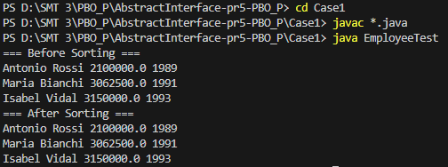
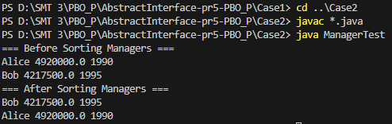
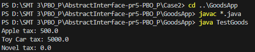

# Abstract & Interface - Praktikum 5 PBO

Repositori ini berisi kode sumber Java untuk tugas **Praktikum 5: Abstract Class dan Interface**.

Proyek ini mendemonstrasikan penerapan konsep abstraksi dalam OOP melalui tiga studi kasus berbeda:
1.  **Case 1 (Employee Sortable):** Menggunakan *Abstract Class* untuk mengurutkan data pegawai.
2.  **Case 2 (Manager Sortable):** Penerapan *Polymorphism* pada Manager yang mewarisi Employee.
3.  **GoodsApp (Taxable Interface):** Menggunakan *Interface* untuk menghitung pajak pada berbagai jenis barang.

## 📂 Daftar Program & Screenshot

Berikut adalah rincian program yang ada dalam repositori ini:

### 1. Case 1: Employee Sorting
Mengimplementasikan *abstract class* `Sortable` pada kelas `Employee` menggunakan algoritma *Shell Sort* untuk mengurutkan pegawai berdasarkan gaji.
> **Output:**
> 

### 2. Case 2: Manager Sorting
Pengembangan dari Case 1, di mana `Manager` adalah subclass dari `Employee`. Program ini membuktikan bahwa algoritma sorting pada parent class tetap bekerja untuk subclass.
> **Output:**
> 

### 3. Goods Application (Interface)
Simulasi aplikasi kasir sederhana. `Food` dan `Toy` mengimplementasikan interface `Taxable` (kena pajak), sedangkan `Book` tidak dikenakan pajak (return 0).
> **Output:**
> 

---

## 🚀 Cara Menjalankan (How to Run)

Karena setiap kasus (Case) berdiri sendiri, **kamu harus masuk ke direktori folder masing-masing** sebelum menjalankan program.

Pastikan kamu sudah menginstal **JDK (Java Development Kit)**.

1.  **Buka Terminal / CMD**.
2.  **Arahkan ke direktori utama folder ini**:
    ```bash
    cd path/to/AbstractInterface-pr5-PBO_P
    ```
3.  **Compile & Run**:
    Ikuti perintah pada tabel di bawah ini sesuai program yang ingin dijalankan:

| Program | Langkah 1: Masuk Folder & Compile | Langkah 2: Jalankan (Run) |
| :--- | :--- | :--- |
| **Case 1** | `cd Case1` <br> `javac *.java` | `java EmployeeTest` |
| **Case 2** | `cd ../Case2` <br> `javac *.java` | `java ManagerTest` |
| **Goods App** | `cd ../GoodsApp` <br> `javac *.java` | `java TestGoods` |

> **Catatan:** Perintah `cd ..` digunakan untuk kembali ke folder sebelumnya jika kamu berpindah antar case.

---

## 👤 Identitas Pengirim

- **Nama** : Qlio Amanda Febriany
- **NIM** : 241511087
- **Kelas** : 2C
- **Prodi** : D3 Teknik Informatika
